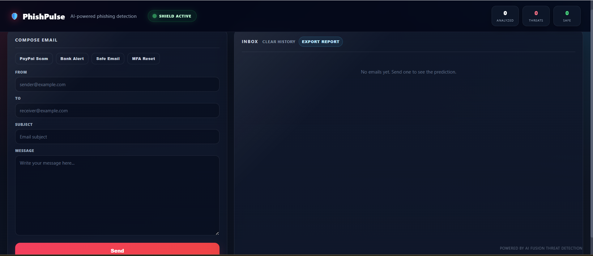
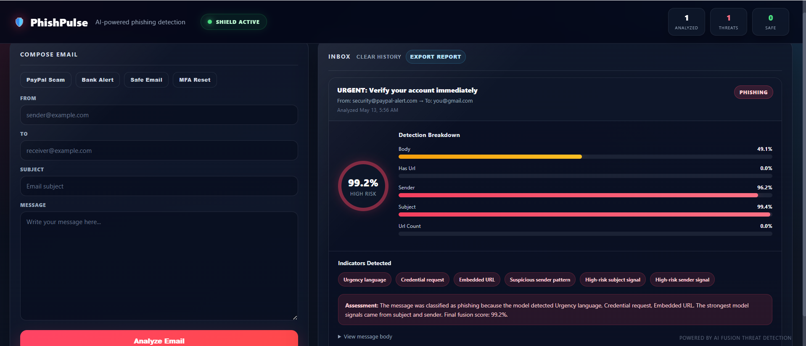
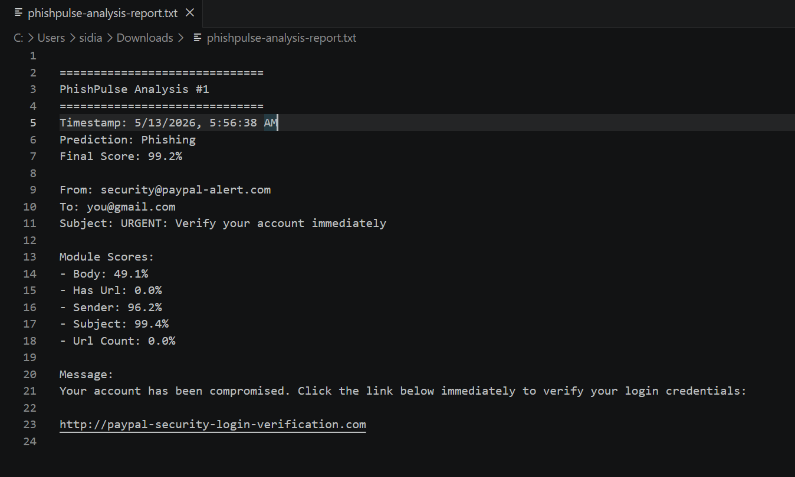

# PhishPulse

PhishPulse is an AI-powered phishing detection platform designed to analyze suspicious emails using a modular machine learning pipeline and an interactive SOC-style dashboard.

The platform evaluates sender reputation, subject-line patterns, body content, and URL-based indicators using modular machine learning analysis. These signals are combined through a fusion-based scoring pipeline to generate a final phishing risk classification and explainable threat assessment.

---

# Features

- SOC-style cybersecurity dashboard
- Real-time phishing analysis
- Sender reputation analysis
- Subject-line threat detection
- Body-content analysis
- URL indicator extraction
- Fusion-model risk scoring
- Explainable AI assessment
- Threat indicator extraction
- Persistent analysis history
- Exportable analysis reports
- Sample phishing simulations
- Dark-themed responsive interface

---

# Key Capabilities

- Modular phishing analysis pipeline
- Explainable AI threat scoring
- Interactive SOC-style visualization
- Persistent local analysis history
- Exportable forensic-style reports
- Real-time phishing simulation workflow

---

# Dashboard Preview

## Main Dashboard



## Phishing Detection Example



## Exported Analysis Report



---

# Architecture

```text
Email Input
   ↓
Sender Analysis Module
Subject Analysis Module
Body Analysis Module
URL Analysis Module
   ↓
Fusion Threat Scoring Model
   ↓
Risk Classification Engine
   ↓
SOC-Style Dashboard + Exportable Report
```

---

# Technology Stack

- Python
- Flask
- scikit-learn
- pandas
- NumPy
- Joblib
- HTML/CSS/JavaScript

---

# Project Structure

```text
PhishPulse/
├── src/
├── static/
├── templates/
├── dataset/
├── graphs/
├── reports/
├── tests/
├── docs/
│   └── images/
├── requirements.txt
└── README.md
```

---

# Installation

Clone the repository:

```bash
git clone https://github.com/Sidiahmedde/PhishPulse.git
cd PhishPulse
```

Create virtual environment:

```powershell
py -m venv .venv
```

Activate environment:

```powershell
.\.venv\Scripts\Activate.ps1
```

Install dependencies:

```powershell
pip install -r requirements.txt
pip install -r .\src\requirements.txt
```

Run the application:

```powershell
python -m src.models.super_model_flask_app
```

Open in browser:

```text
http://localhost:5000
```

---

# Demo Workflow

1. Launch the Flask application
2. Open the PhishPulse dashboard
3. Select a sample phishing scenario or create a custom email
4. Click **Analyze Email**
5. Review:
   - Final phishing classification
   - Module-level risk scores
   - Threat indicators
   - Risk explanations
6. Export the generated analysis report

---

# Example Threat Indicators

PhishPulse extracts suspicious indicators such as:

- Urgency language
- Credential requests
- Suspicious sender patterns
- Embedded phishing URLs
- Financial/account-related themes
- High-risk sender or subject scores

---

# Exportable Reports

The platform can generate downloadable phishing analysis reports including:

- Timestamp
- Prediction
- Final risk score
- Module scores
- Sender/recipient metadata
- Message content
- Detection indicators

---

# Limitations

PhishPulse is an academic and demonstration-oriented cybersecurity project designed for phishing analysis research and visualization. It is not intended to replace enterprise-grade secure email gateways, production SIEM systems, or professional incident response workflows.

Predictions should be interpreted as decision-support signals rather than definitive security determinations.

---

# Future Improvements

- Live threat intelligence integration
- Domain reputation APIs
- Email header analysis
- Attachment scanning
- User authentication
- Database-backed history
- SIEM integration
- Analyst collaboration features

---

# Author

Sidi Ahmed Brahim

MS Cyber Security Engineering  
George Mason University

---

## Acknowledgment

This project originated as part of a collaborative academic phishing detection effort. The current repository includes significant independent frontend, UX, dashboard, reporting, and deployment enhancements developed by Sidi Ahmed Brahim.


---

# License

This project is licensed under the MIT License.
